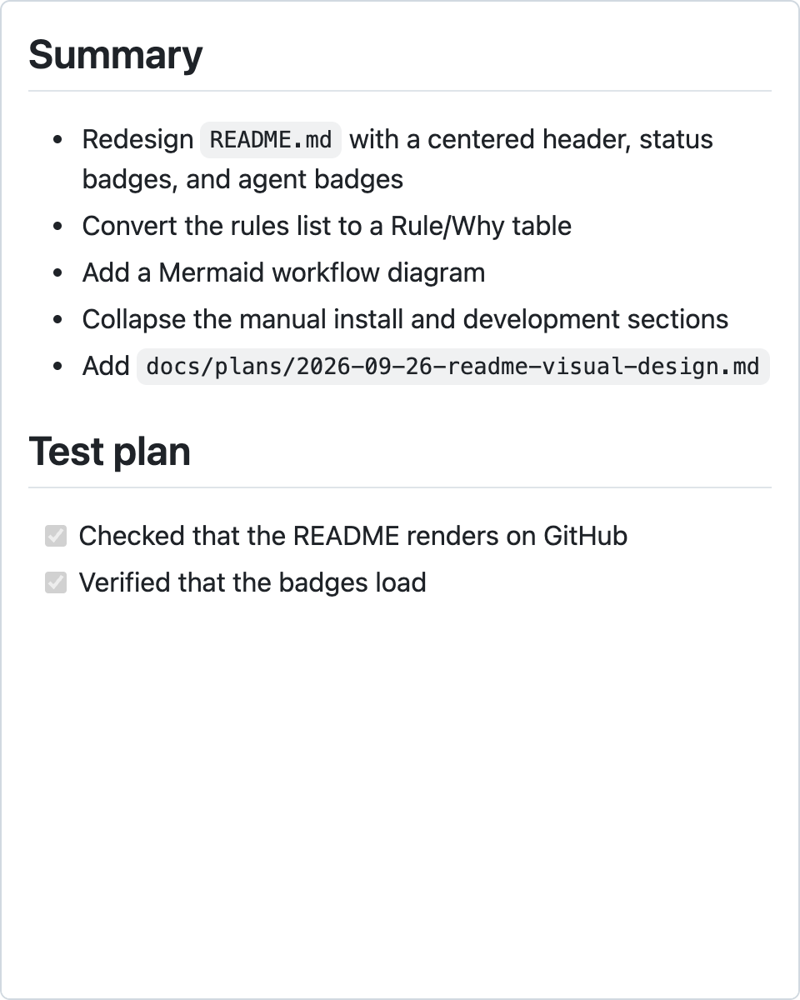
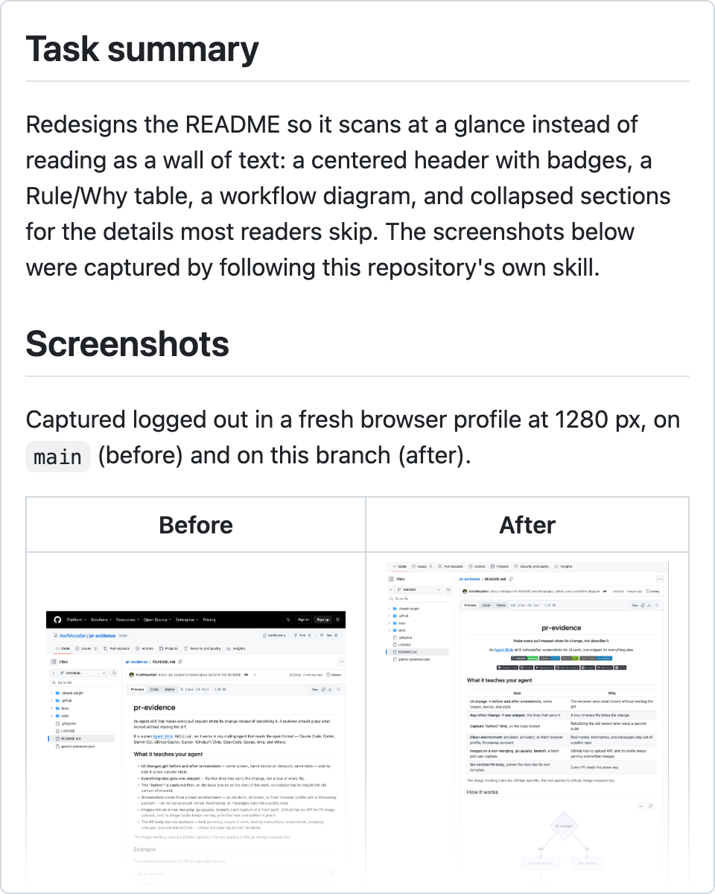
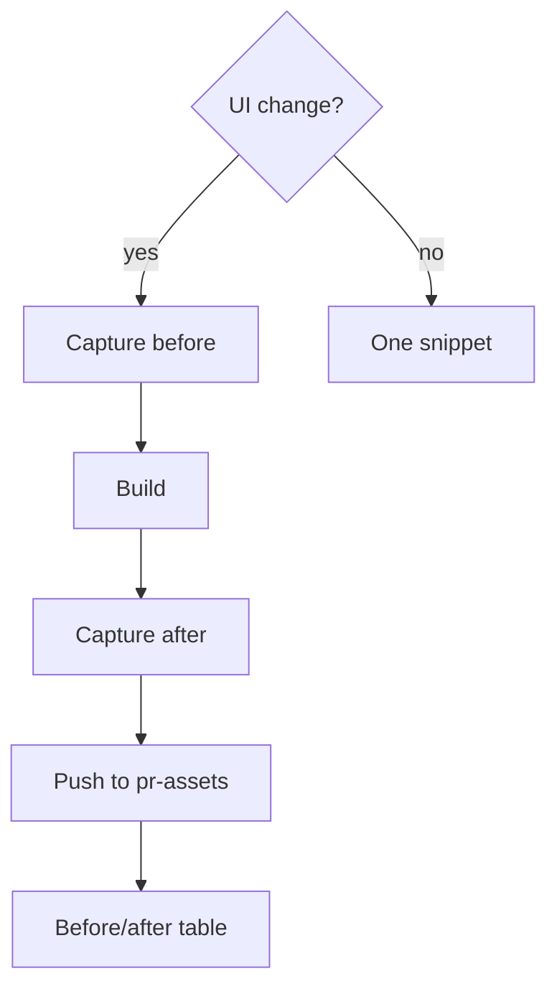
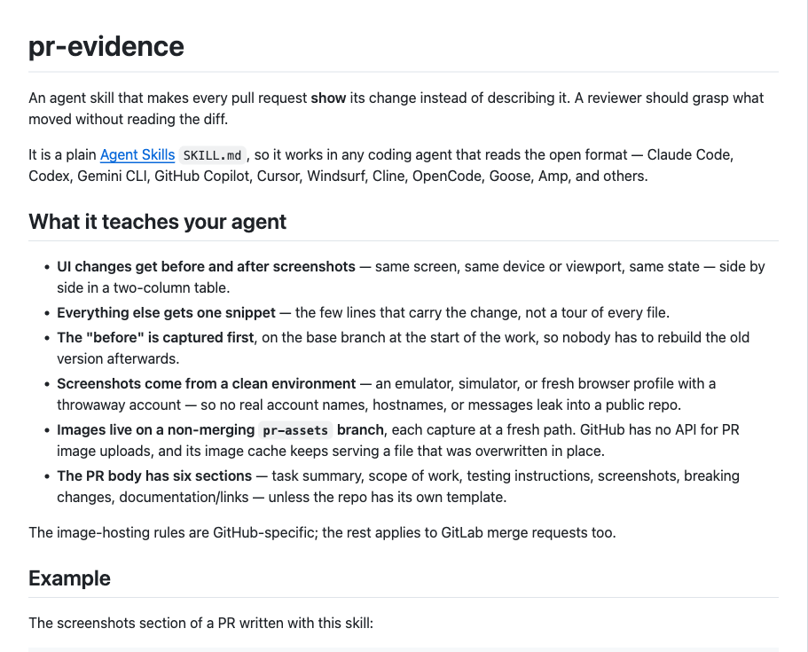
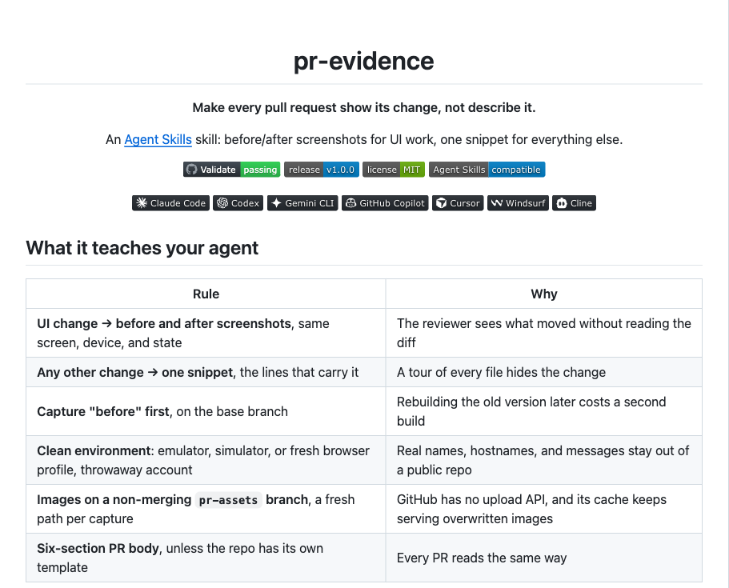

<div align="center">

# pr-evidence

**Make every pull request show its change, not describe it.**

An [Agent Skills](https://agentskills.io) skill: before/after screenshots for UI work,
one snippet for everything else.

[![Validate][badge-validate]][link-validate]
[![Release][badge-release]][link-releases]
[![License][badge-license]](LICENSE)
[![Agent Skills][badge-agent-skills]](https://agentskills.io)

[![Claude Code][badge-claude-code]](#install)
[![Codex][badge-codex]](#install)
[![Gemini CLI][badge-gemini-cli]](#install)
[![GitHub Copilot][badge-github-copilot]](#install)
[![Cursor][badge-cursor]](#install)
[![Windsurf][badge-windsurf]](#install)
[![Cline][badge-cline]](#install)

</div>

<table>
  <tr>
    <th width="50%">Without the skill</th>
    <th width="50%">With the skill</th>
  </tr>
  <tr>
    <td>
      <picture>
        <source media="(prefers-color-scheme: dark)" srcset="docs/assets/hero-without-dark.png">
        
      </picture>
    </td>
    <td>
      <picture>
        <source media="(prefers-color-scheme: dark)" srcset="docs/assets/hero-with-dark.png">
        
      </picture>
    </td>
  </tr>
</table>

The same change, [pull request #3](https://github.com/ArefMozafari/pr-evidence/pull/3), written up both ways.
The right side is an excerpt of its real description, rendered with GitHub's Markdown styles.

## What it teaches your agent

| Rule | Why |
| --- | --- |
| **UI change → before and after screenshots**, same screen, device, and state | The reviewer sees what moved without reading the diff |
| **Any other change → one snippet**, the lines that carry it | A tour of every file hides the change |
| **Capture "before" first**, on the base branch | Rebuilding the old version later costs a second build |
| **Clean environment**: emulator, simulator, or fresh browser profile, throwaway account | Real names, hostnames, and messages stay out of a public repo |
| **Images on a non-merging `pr-assets` branch**, a fresh path per capture | GitHub has no upload API, and its cache keeps serving overwritten images |
| **Six-section PR body**, unless the repo has its own template | Every PR reads the same way |

The image-hosting rules are GitHub-specific; the rest applies to GitLab merge requests too.

## How it works



## Example

This README's own redesign in [pull request #3](https://github.com/ArefMozafari/pr-evidence/pull/3),
laid out the way the skill writes a screenshots section:

<table>
  <tr>
    <th width="50%">Before</th>
    <th width="50%">After</th>
  </tr>
  <tr>
    <td>
      <picture>
        <source media="(prefers-color-scheme: dark)" srcset="docs/assets/example-before-dark.png">
        
      </picture>
    </td>
    <td>
      <picture>
        <source media="(prefers-color-scheme: dark)" srcset="docs/assets/example-after-dark.png">
        
      </picture>
    </td>
  </tr>
</table>

<details>
<summary><b>The Markdown behind a screenshots section</b></summary>

<br>

The images live on the repository's non-merging `pr-assets` branch, one fresh folder per capture:

```markdown
## Screenshots

| Before | After |
| --- | --- |
| ![Before][before] | ![After][after] |

[before]: https://github.com/ArefMozafari/pr-evidence/blob/pr-assets/3/1/readme-before-light.png?raw=true
[after]: https://github.com/ArefMozafari/pr-evidence/blob/pr-assets/3/1/readme-after-light.png?raw=true
```

</details>

## Install

| Agent | Command |
| --- | --- |
| ![Claude Code][badge-claude-code] | `/plugin marketplace add ArefMozafari/pr-evidence`<br>`/plugin install pr-evidence@pr-evidence` |
| ![Gemini CLI][badge-gemini-cli] | `gemini extensions install https://github.com/ArefMozafari/pr-evidence` |
| ![GitHub Copilot CLI][badge-github-copilot-cli] | `copilot plugin marketplace add ArefMozafari/pr-evidence`<br>`copilot plugin install pr-evidence@pr-evidence` |
| ![Cursor][badge-cursor] | `agent plugin marketplace add https://github.com/ArefMozafari/pr-evidence`<br>then `/plugins` in `agent` and install `pr-evidence` |
| ![Codex][badge-codex] ![Cursor][badge-cursor] ![Windsurf][badge-windsurf] ![Cline][badge-cline] and more | `npx skills add ArefMozafari/pr-evidence` |
| ![GitHub CLI][badge-github-cli] for Copilot and other agents | `gh skill install ArefMozafari/pr-evidence` |

<details>
<summary><b>Manual install</b></summary>

<br>

Copy the `skills/pr-evidence` folder into your agent's skills directory:

| Agent | Directory |
| --- | --- |
| Claude Code | `~/.claude/skills/` |
| Codex, Gemini CLI, GitHub Copilot, Cursor, Windsurf, OpenCode, Goose, Amp | `~/.agents/skills/` |
| Cline | `~/.cline/skills/` |

</details>

<details>
<summary><b>Development</b></summary>

<br>

Every push is checked by [`.github/workflows/validate.yml`](.github/workflows/validate.yml).
To run the skill and Claude Code checks locally from the repository root:

```bash
uvx --from skills-ref==0.1.1 agentskills validate skills/pr-evidence
claude plugin validate --strict .claude-plugin/marketplace.json
claude plugin validate --strict .claude-plugin/plugin.json
```

The workflow also checks the Gemini manifest's fields and validates the Cursor manifests against
the JSON schemas Cursor publishes.

</details>

## More skills

- [review-findings](https://github.com/ArefMozafari/review-findings): report every code review
  finding in one shape, ready to paste.
- [review-replies](https://github.com/ArefMozafari/review-replies): answer review comments on your
  own pull request one thread at a time.
- [post-merge-cleanup](https://github.com/ArefMozafari/post-merge-cleanup): clean up branches,
  worktrees, and stale notes once a pull request has merged.

## License

MIT. See [LICENSE](LICENSE).

<!-- Badge images are defined once here and reused by the header and the install table. -->

[link-validate]: https://github.com/ArefMozafari/pr-evidence/actions/workflows/validate.yml
[link-releases]: https://github.com/ArefMozafari/pr-evidence/releases
[badge-validate]: https://github.com/ArefMozafari/pr-evidence/actions/workflows/validate.yml/badge.svg
[badge-release]: https://img.shields.io/github/v/release/ArefMozafari/pr-evidence
[badge-license]: https://img.shields.io/github/license/ArefMozafari/pr-evidence
[badge-agent-skills]: https://img.shields.io/badge/Agent_Skills-compatible-blue
[badge-claude-code]: https://img.shields.io/badge/Claude_Code-24292F?logo=claude&logoColor=white
[badge-gemini-cli]: https://img.shields.io/badge/Gemini_CLI-24292F?logo=googlegemini&logoColor=white
[badge-github-copilot]: https://img.shields.io/badge/GitHub_Copilot-24292F?logo=githubcopilot&logoColor=white
[badge-github-copilot-cli]: https://img.shields.io/badge/GitHub_Copilot_CLI-24292F?logo=githubcopilot&logoColor=white
[badge-cursor]: https://img.shields.io/badge/Cursor-24292F?logo=cursor&logoColor=white
[badge-windsurf]: https://img.shields.io/badge/Windsurf-24292F?logo=windsurf&logoColor=white
[badge-cline]: https://img.shields.io/badge/Cline-24292F?logo=cline&logoColor=white
[badge-github-cli]: https://img.shields.io/badge/GitHub_CLI-24292F?logo=github&logoColor=white

<!-- Shields.io's icon set has no OpenAI logo, so the Codex badge embeds the simple-icons SVG. -->

[badge-codex]: https://img.shields.io/badge/Codex-24292F?logo=data:image/svg%2bxml;base64,PHN2ZyBmaWxsPSJ3aGl0ZSIgcm9sZT0iaW1nIiB2aWV3Qm94PSIwIDAgMjQgMjQiIHhtbG5zPSJodHRwOi8vd3d3LnczLm9yZy8yMDAwL3N2ZyI+PHRpdGxlPk9wZW5BSTwvdGl0bGU+PHBhdGggZD0iTTIyLjI4MTkgOS44MjExYTUuOTg0NyA1Ljk4NDcgMCAwIDAtLjUxNTctNC45MTA4IDYuMDQ2MiA2LjA0NjIgMCAwIDAtNi41MDk4LTIuOUE2LjA2NTEgNi4wNjUxIDAgMCAwIDQuOTgwNyA0LjE4MThhNS45ODQ3IDUuOTg0NyAwIDAgMC0zLjk5NzcgMi45IDYuMDQ2MiA2LjA0NjIgMCAwIDAgLjc0MjcgNy4wOTY2IDUuOTggNS45OCAwIDAgMCAuNTExIDQuOTEwNyA2LjA1MSA2LjA1MSAwIDAgMCA2LjUxNDYgMi45MDAxQTUuOTg0NyA1Ljk4NDcgMCAwIDAgMTMuMjU5OSAyNGE2LjA1NTcgNi4wNTU3IDAgMCAwIDUuNzcxOC00LjIwNTggNS45ODk0IDUuOTg5NCAwIDAgMCAzLjk5NzctMi45MDAxIDYuMDU1NyA2LjA1NTcgMCAwIDAtLjc0NzUtNy4wNzI5em0tOS4wMjIgMTIuNjA4MWE0LjQ3NTUgNC40NzU1IDAgMCAxLTIuODc2NC0xLjA0MDhsLjE0MTktLjA4MDQgNC43NzgzLTIuNzU4MmEuNzk0OC43OTQ4IDAgMCAwIC4zOTI3LS42ODEzdi02LjczNjlsMi4wMiAxLjE2ODZhLjA3MS4wNzEgMCAwIDEgLjAzOC4wNTJ2NS41ODI2YTQuNTA0IDQuNTA0IDAgMCAxLTQuNDk0NSA0LjQ5NDR6bS05LjY2MDctNC4xMjU0YTQuNDcwOCA0LjQ3MDggMCAwIDEtLjUzNDYtMy4wMTM3bC4xNDIuMDg1MiA0Ljc4MyAyLjc1ODJhLjc3MTIuNzcxMiAwIDAgMCAuNzgwNiAwbDUuODQyOC0zLjM2ODV2Mi4zMzI0YS4wODA0LjA4MDQgMCAwIDEtLjAzMzIuMDYxNUw5Ljc0IDE5Ljk1MDJhNC40OTkyIDQuNDk5MiAwIDAgMS02LjE0MDgtMS42NDY0ek0yLjM0MDggNy44OTU2YTQuNDg1IDQuNDg1IDAgMCAxIDIuMzY1NS0xLjk3MjhWMTEuNmEuNzY2NC43NjY0IDAgMCAwIC4zODc5LjY3NjVsNS44MTQ0IDMuMzU0My0yLjAyMDEgMS4xNjg1YS4wNzU3LjA3NTcgMCAwIDEtLjA3MSAwbC00LjgzMDMtMi43ODY1QTQuNTA0IDQuNTA0IDAgMCAxIDIuMzQwOCA3Ljg3MnptMTYuNTk2MyAzLjg1NThMMTMuMTAzOCA4LjM2NCAxNS4xMTkyIDcuMmEuMDc1Ny4wNzU3IDAgMCAxIC4wNzEgMGw0LjgzMDMgMi43OTEzYTQuNDk0NCA0LjQ5NDQgMCAwIDEtLjY3NjUgOC4xMDQydi01LjY3NzJhLjc5Ljc5IDAgMCAwLS40MDctLjY2N3ptMi4wMTA3LTMuMDIzMWwtLjE0Mi0uMDg1Mi00Ljc3MzUtMi43ODE4YS43NzU5Ljc3NTkgMCAwIDAtLjc4NTQgMEw5LjQwOSA5LjIyOTdWNi44OTc0YS4wNjYyLjA2NjIgMCAwIDEgLjAyODQtLjA2MTVsNC44MzAzLTIuNzg2NmE0LjQ5OTIgNC40OTkyIDAgMCAxIDYuNjgwMiA0LjY2ek04LjMwNjUgMTIuODYzbC0yLjAyLTEuMTYzOGEuMDgwNC4wODA0IDAgMCAxLS4wMzgtLjA1NjdWNi4wNzQyYTQuNDk5MiA0LjQ5OTIgMCAwIDEgNy4zNzU3LTMuNDUzN2wtLjE0Mi4wODA1TDguNzA0IDUuNDU5YS43OTQ4Ljc5NDggMCAwIDAtLjM5MjcuNjgxM3ptMS4wOTc2LTIuMzY1NGwyLjYwMi0xLjQ5OTggMi42MDY5IDEuNDk5OHYyLjk5OTRsLTIuNTk3NCAxLjQ5OTctMi42MDY3LTEuNDk5N1oiLz48L3N2Zz4=
